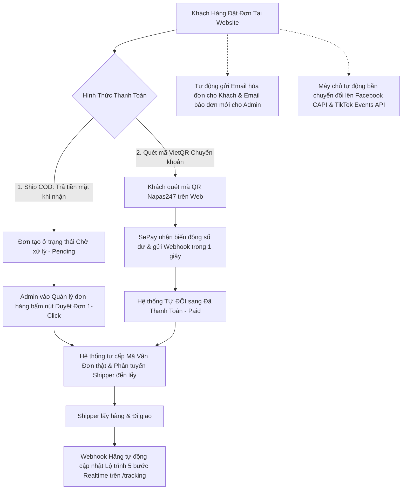

# 📚 CẨM NANG HƯỚNG DẪN CẤU HÌNH HỆ THỐNG TRÊN TRANG QUẢN TRỊ ADMIN
## GHN • GHTK • VIETTEL POST • SEPAY (VIETQR) • FACEBOOK PIXEL & CAPI • TIKTOK PIXEL & EVENTS API • GMAIL SMTP

Tài liệu này hướng dẫn chi tiết từng bước thao tác trực tiếp trên giao diện **Trang Quản Trị Website (/admin)** và các cổng đối tác bên thứ 3 (không yêu cầu kiến thức lập trình hay gõ lệnh API).

---

## 📑 MỤC LỤC CHI TIẾT

1. [Tổng Quan Kiến Trúc Vận Hành Tự Động Hóa 1-Chạm](#1-tổng-quan-kiến-trúc-vận-hành-tự-động-hóa-1-chạm)
2. [Cấu Hình Giao Hàng Nhanh (GHN) trên Trang Quản Trị](#2-cấu-hình-giao-hàng-nhanh-ghn-trên-trang-quản-trị)
3. [Cấu Hình Giao Hàng Tiết Kiệm (GHTK) trên Trang Quản Trị](#3-cấu-hình-giao-hàng-tiết-kiệm-ghtk-trên-trang-quản-trị)
4. [Cấu Hình Viettel Post (VTP) trên Trang Quản Trị](#4-cấu-hình-viettel-post-vtp-trên-trang-quản-trị)
5. [Cấu Hình Cổng Thanh Toán VietQR & SePay Webhook trên Trang Quản Trị](#5-cấu-hình-cổng-thanh-toán-vietqr--sepay-webhook-trên-trang-quản-trị)
6. [Cấu Hình Facebook Pixel & Meta Conversions API (CAPI) trên Trang Quản Trị](#6-cấu-hình-facebook-pixel--meta-conversions-api-capi-trên-trang-quản-trị)
7. [Cấu Hình TikTok Pixel & TikTok Events API trên Trang Quản Trị](#7-cấu-hình-tiktok-pixel--tiktok-events-api-trên-trang-quản-trị)
8. [Cấu Hình Gửi Email Thông Báo Tự Động (Gmail SMTP) trên Trang Quản Trị](#8-cấu-hình-gửi-email-thông-báo-tự-động-gmail-smtp-trên-trang-quản-trị)
9. [Bảng Tổng Hợp URL Webhook Điền Trên Cổng Đối Tác](#9-bảng-tổng-hợp-url-webhook-điền-trên-cổng-đối-tác)
10. [Quy Trình Vận Hành & Hướng Dẫn Xử Lý Sự Cố Thường Gặp](#10-quy-trình-vận-hành--hướng-dẫn-xử-lý-sự-cố-thường-gặp)

---

## 1. TỔNG QUAN KIẾN TRÚC VẬN HÀNH TỰ ĐỘNG HÓA 1-CHẠM



---

## 2. CẤU HÌNH GIAO HÀNG NHANH (GHN) TRÊN TRANG QUẢN TRỊ

### 🔹 Bước 1: Lấy Token API & Shop ID trên Cổng GHN
1. Truy cập và đăng nhập: 👉 [khachhang.ghn.vn](https://khachhang.ghn.vn).
2. Bấm vào **Tên tài khoản** ở góc trên bên phải $\rightarrow$ Chọn **Quản lý tài khoản** (hoặc *Thông tin cá nhân*).
3. Copy 2 thông tin quan trọng:
   - **Token API:** Chuỗi mã khóa bảo mật do GHN cấp.
   - **Mã cửa hàng (Shop ID):** Dãy số định danh kho của bạn (Ví dụ: `190823` hoặc `4827162`).
4. Tại mục **Quản lý cửa hàng / Địa chỉ lấy hàng**: Đảm bảo đã có địa chỉ kho và Số điện thoại liên hệ để bưu tá đến lấy bưu kiện.

---

### 🔹 Bước 2: Nhập Cấu Hình trên Trang Quản Trị Website
1. Mở trang quản trị: 👉 **`https://<YOUR_DOMAIN>/admin/shipping`**
2. Bấm vào nút màu xanh: **`[⚙️ Cấu Hình Token API & Shop ID]`**.
3. Tại cửa sổ Modal hiện lên, chọn tab **`GHN (Giao Hàng Nhanh)`**:
   - **Bật kết nối hãng:** Gạt sang `Bật`.
   - **Môi trường:** Chọn `Production (Môi trường thật)`.
   - **Token API:** Dán Token API GHN của bạn.
   - **Shop ID:** Dán Shop ID GHN của bạn.
4. Bấm nút **`[Lưu Cấu Hình Vào Database]`**.

---

### 🔹 Bước 3: Kiểm Tra Kết Nối
1. Bấm nút **`[Kiểm Tra Kết Nối]`** ngay trong tab GHN.
2. Hệ thống sẽ kết nối trực tiếp với máy chủ GHN và hiển thị thông báo màu xanh:
   ```text
   ✓ Kết nối GHN thành công! Token hợp lệ (Tài khoản đang có X cửa hàng hoạt động).
   ```

---

## 3. CẤU HÌNH GIAO HÀNG TIẾT KIỆM (GHTK) TRÊN TRANG QUẢN TRỊ

### 🔹 Bước 1: Lấy Token API trên Cổng GHTK
1. Đăng nhập cổng đối tác: 👉 [khachhang.giaohangtietkiem.vn](https://khachhang.giaohangtietkiem.vn).
2. Vào **Cài đặt tài khoản** $\rightarrow$ Chọn mục **Tích hợp API** $\rightarrow$ Copy chuỗi **API Token Key**.

---

### 🔹 Bước 2: Cài Đặt Webhook trên Cổng GHTK
1. Trên cổng GHTK, vào mục **Cài đặt tài khoản** $\rightarrow$ **Cấu hình Webhook**.
2. Bấm nút **Chỉnh sửa / Thêm Webhook** và điền chính xác:

| Trường Dữ Liệu | Giá Trị Điền / Chọn | Ghi Chú |
| :--- | :--- | :--- |
| **Trạng thái \*** | **`◉ Hoạt động`** *(Màu xanh lá)* | Bắt buộc bật |
| **Data format \*** | **`JSON`** *(hoặc `application/json`)* | Định dạng dữ liệu |
| **URL đích \*** | 👉 **`https://<YOUR_DOMAIN>/api/webhooks/shipping?carrier=ghtk`** | Điền tên miền web thật của bạn |
| **Headers** | *(Để trống)* | Không cần điền |

3. Bấm **`[Lưu thông tin]`**.

---

### 🔹 Bước 3: Nhập Cấu Hình trên Trang Quản Trị Website
1. Mở trang quản trị: 👉 **`https://<YOUR_DOMAIN>/admin/shipping`**
2. Bấm nút **`[⚙️ Cấu Hình Token API & Shop ID]`** $\rightarrow$ Chọn tab **`GHTK`**:
   - **Kích hoạt:** Gạt sang `Bật`.
   - **Môi trường:** `Production`.
   - **Token API:** Dán mã Token GHTK của bạn.
3. Bấm **`[Lưu Cấu Hình Vào Database]`**.
4. Bấm nút **`[Kiểm Tra Kết Nối]`** $\rightarrow$ Nhận phản hồi thành công:
   ```text
   ✓ Kết nối GHTK thành công! Token API hợp lệ và hoạt động bình thường.
   ```

---

## 4. CẤU HÌNH VIETTEL POST (VTP) TRÊN TRANG QUẢN TRỊ

1. Đăng nhập: 👉 [viettelpost.vn](https://viettelpost.vn) $\rightarrow$ Vào **Cài đặt tài khoản / Tích hợp API** để lấy **Token API**.
2. Mở **`https://<YOUR_DOMAIN>/admin/shipping`** $\rightarrow$ Bấm **`[⚙️ Cấu Hình Token API & Shop ID]`** $\rightarrow$ Chọn tab **Viettel Post**.
3. Dán Token API $\rightarrow$ Bấm **`[Lưu Cấu Hình]`** và bấm **`[Kiểm Tra Kết Nối]`**.
4. Cài đặt Webhook URL trên Viettel Post:
   - 👉 **`https://<YOUR_DOMAIN>/api/webhooks/shipping?carrier=viettelpost`**

---

## 5. CẤU HÌNH CỔNG THANH TOÁN VIETQR & SEPAY WEBHOOK TRÊN TRANG QUẢN TRỊ

### 🔹 Bước 1: Cấu Hình Tài Khoản Nhận Tiền (/admin/payment)
1. Truy cập trang quản trị: 👉 **`https://<YOUR_DOMAIN>/admin/payment`**
2. Tại mục **Thông Tin Tài Khoản Thụ Hưởng (VietQR)**:
   - **Phương thức Chuyển khoản VietQR:** Gạt sang `Đang Bật`.
   - **Ngân hàng thụ hưởng:** Chọn ngân hàng bạn sử dụng trong danh sách *(Ví dụ: `MBBank`, `Vietcombank`, `Techcombank`, `ACB`, `MSB`, `VPBank`, `Agribank`...)*.
   - **Số tài khoản ngân hàng \*:** Nhập chính xác số tài khoản nhận tiền.
   - **Tên chủ tài khoản \*:** Nhập tên in hoa không dấu *(Ví dụ: `LE VAN AN`)*.
   - **SePay API Token:** Dán mã API Key từ SePay (nếu có).
3. Bấm **`[💾 Lưu Cấu Hình Phương Thức Thanh Toán]`**.
4. Hệ thống sẽ tự động hiển thị mẫu mã **VietQR Napas247** xem trước ngay bên cạnh.

---

### 🔹 Bước 2: Tạo Webhook trên Cổng SePay (my.sepay.vn)
1. Đăng ký/Đăng nhập: 👉 [my.sepay.vn](https://my.sepay.vn).
2. Vào mục **Tài khoản ngân hàng** $\rightarrow$ Bấm **Thêm tài khoản** để liên kết ngân hàng của bạn.
3. Vào menu **Tích hợp Webhook** $\rightarrow$ Bấm **`[Thêm Webhook]`**:

| Trường Thông Tin | Giá Trị Cần Điền |
| :--- | :--- |
| **URL Webhook (Gọi lại)** | 👉 **`https://<YOUR_DOMAIN>/api/webhooks/sepay`** *(bấm nút Copy URL trên trang /admin/payment)* |
| **Data Format** | **`JSON`** |
| **Sự kiện kích hoạt** | Tích chọn **`Giao dịch tiền vào (in)`** |
| **Phương thức** | **`POST`** |

4. Bấm **`[Lưu Webhook]`**.

---

### 🔹 Bước 3: Kiểm Thử Webhook Trực Tiếp Trên Giao Diện Admin
1. Ngay tại trang **`/admin/payment`**, cuộn xuống khung **Bộ Giả Lập Webhook SePay (Simulator)**.
2. Nhập một mã đơn hàng thử nghiệm (Ví dụ: `ST2602`) và số tiền đơn hàng.
3. Bấm nút: **`[🚀 Gửi Thử Nghiệm Webhook SePay]`**.
4. Khung kết quả hiển thị `Status: 200` và thông báo đơn hàng đã tự động chuyển sang `Đã thanh toán (Paid)` thành công!

---

## 6. CẤU HÌNH FACEBOOK PIXEL & META CONVERSIONS API (CAPI) TRÊN TRANG QUẢN TRỊ

### 🔹 Bước 1: Lấy Pixel ID & Tạo Access Token trên Meta
1. Truy cập Trình cài đặt doanh nghiệp Meta: 👉 [business.facebook.com/latest/settings/events_dataset_and_pixel](https://business.facebook.com/latest/settings/events_dataset_and_pixel).
2. Tại mục **Tập dữ liệu (Datasets)** $\rightarrow$ Bấm **`[+ Thêm]`** $\rightarrow$ Đặt tên Pixel (Ví dụ: `ShopBig Pixel`) $\rightarrow$ Bấm **Tạo**.
3. **Phân quyền Quản trị (BẮT BUỘC):** Bấm nút **`[Thêm người]`** $\rightarrow$ Tích chọn tài khoản Facebook của bạn $\rightarrow$ Bật **Toàn quyền kiểm soát** $\rightarrow$ Bấm **Chỉ định**.
4. Copy dãy số **ID Tập dữ liệu (Pixel ID)** (gồm 15-16 chữ số, ví dụ: `1704901287459412`).
5. Bấm nút **`[Mở trong Trình quản lý sự kiện]`** $\rightarrow$ Chọn tab **Cài đặt (Settings)** $\rightarrow$ Cuộn đến mục **API chuyển đổi (Conversions API)** $\rightarrow$ Bấm **`[Tạo mã truy cập]`** *(Generate access token)* $\rightarrow$ Copy chuỗi token dài bắt đầu bằng **`EAAB...`**.
6. Chuyển sang tab **Thử nghiệm sự kiện (Test events)** $\rightarrow$ Copy mã **`TESTxxxxx`** (nếu muốn xem live test).

---

### 🔹 Bước 2: Nhập Cấu Hình trên Trang Quản Trị Website (/admin/marketing)
1. Mở trang quản trị: 👉 **`https://<YOUR_DOMAIN>/admin/marketing`**
2. Chọn tab **`Facebook Pixel & CAPI`**:
   - **Trạng thái:** Gạt sang **`Đang Bật`**.
   - **Facebook Pixel ID \*:** Dán dãy số Pixel ID.
   - **Mã Sự Kiện Thử Nghiệm (Test Event Code):** Dán mã `TESTxxxxx` (hoặc để trống khi chạy quảng cáo thật).
   - **Conversions API Access Token (CAPI Token):** Dán mã token `EAAB...`.
3. Bấm nút **`[💾 Lưu Cấu Hình]`** ở góc trên bên phải.

---

### 🔹 Bước 3: Bấm Nút Test Kiểm Tra Trực Tiếp trên Giao Diện Admin
1. Ngay tại tab Facebook, bấm nút: **`[🧪 Gửi sự kiện test lên Facebook CAPI]`**.
2. Khung phản hồi trả về ngay lập tức:
   ```json
   {
     "success": true,
     "results": {
       "facebook": {
         "success": true,
         "status": 200,
         "response": {
           "events_received": 1,
           "fbtrace_id": "A..."
         }
       }
     }
   }
   ```
3. Mở tab **Test events** trên Meta Events Manager để thấy sự kiện `Purchase` máy chủ nhảy realtime!

---

## 7. CẤU HÌNH TIKTOK PIXEL & TIKTOK EVENTS API TRÊN TRANG QUẢN TRỊ

### 🔹 Bước 1: Tạo Pixel trên TikTok Ads Manager
1. Truy cập: 👉 [ads.tiktok.com/i18n/event_manager](https://ads.tiktok.com/i18n/event_manager).
2. Bấm **`[Connect data source]`** $\rightarrow$ Chọn **`Web`** $\rightarrow$ Chọn **Thiết lập thủ công**.
3. Chọn **`API Pixel và Sự kiện TikTok (Khuyến khích)`** $\rightarrow$ Đặt tên $\rightarrow$ Bấm **Tạo nên**.
4. Copy **TikTok Pixel ID** *(Ví dụ: `DA3SC0BC77UC1JSQM8E0`)*.
5. Bật công tắc **`Đối sánh nâng cao tự động (AAM)`** $\rightarrow$ Chọn mẫu phễu **`E-commerce`**.
6. Tại bước tạo mã truy cập, bấm nút màu đen **`[Tạo mã truy cập]`** $\rightarrow$ Copy chuỗi Access Token dài $\rightarrow$ Bấm **Hoàn thành**.

---

### 🔹 Bước 2: Nhập Cấu Hình trên Trang Quản Trị Website (/admin/marketing)
1. Mở trang quản trị: 👉 **`https://<YOUR_DOMAIN>/admin/marketing`**
2. Chọn tab **`TikTok Pixel & Events API`**:
   - **Trạng thái:** Gạt sang **`Đang Bật`**.
   - **TikTok Pixel ID \*:** Dán TikTok Pixel ID.
   - **TikTok Test Event Code:** Dán mã test từ tab Test Events của TikTok (nếu cần).
   - **TikTok Events API Access Token:** Dán chuỗi Access Token vừa tạo.
3. Bấm nút **`[💾 Lưu Cấu Hình]`**.

---

### 🔹 Bước 3: Bấm Nút Test Kiểm Tra trên Giao Diện Admin
1. Bấm nút màu hồng: **`[🧪 Gửi sự kiện test lên TikTok Events API]`**.
2. Kiểm tra phản hồi trực tiếp:
   ```json
   {
     "success": true,
     "results": {
       "tiktok": {
         "success": true,
         "status": 200,
         "response": { "code": 0, "message": "OK" }
       }
     }
   }
   ```

---

## 8. CẤU HÌNH GỬI EMAIL THÔNG BÁO TỰ ĐỘNG (GMAIL SMTP) TRÊN TRANG QUẢN TRỊ

### 🔹 Bước 1: Tạo Mật Khẩu Ứng Dụng Google 16 Ký Tự
1. Đăng nhập Gmail dùng để gửi thư $\rightarrow$ Mở: 👉 [myaccount.google.com/security](https://myaccount.google.com/security).
2. Bật **Xác minh 2 bước (2-Step Verification)** *(bắt buộc)*.
3. Truy cập trang tạo mật khẩu ứng dụng: 👉 [myaccount.google.com/apppasswords](https://myaccount.google.com/apppasswords).
4. Nhập tên ứng dụng: `ShopBig Web` $\rightarrow$ Bấm **`[Tạo]`**.
5. Copy chuỗi **16 ký tự** được cấp (Ví dụ: `abcd efgh ijkl mnop`).

---

### 🔹 Bước 2: Nhập Cấu Hình trên Trang Quản Trị Website (/admin/settings)
1. Mở trang quản trị: 👉 **`https://<YOUR_DOMAIN>/admin/settings`**
2. Bấm vào tab **`<FiMail /> Cấu Hình Email (SMTP)`**:
   - **Kích hoạt gửi Email tự động:** Gạt công tắc sang **`Đang Bật`**.
   - **Tài khoản Email gửi (Gmail / SMTP User) \*:** Nhập địa chỉ Gmail của bạn (Ví dụ: `cuahang.shopbig@gmail.com`).
   - **Mật khẩu ứng dụng SMTP (Google App Password) \*:** Dán chuỗi 16 ký tự vừa tạo ở Bước 1.
   - **Tên người gửi hiển thị (Sender Name):** Nhập tên shop (Ví dụ: `ShopBig Store`).
   - **Email Admin nhận thông báo đơn mới \*:** Nhập email của bạn (Ví dụ: `admin@shopbig.vn`).
   - **Tùy chọn người nhận:**
     - Tích chọn: `Gửi email hóa đơn xác nhận cho Khách hàng`.
     - Tích chọn: `Gửi email cảnh báo đơn mới cho Admin / Chủ Shop`.
3. Bấm nút **`[💾 Lưu Cấu Hình Email]`**.

---

### 🔹 Bước 3: Gửi Thử Email Kiểm Tra Trực Tiếp trên Giao Diện Admin
1. Ngay bên dưới form cấu hình, tại khung **`[✉️ Kiểm Tra Kết Nối Gửi Thư (Send Test Email)]`**:
   - Nhập địa chỉ email cá nhân bạn muốn nhận thư test vào ô nhập.
   - Bấm nút: **`[Gửi Thử Email]`**.
2. Hệ thống báo: `Đã gửi email thử nghiệm thành công!`. Bạn mở hộp thư đến để chiêm ngưỡng email mẫu với thiết kế chuyên nghiệp!

---

## 9. BẢNG TỔNG HỢP URL WEBHOOK ĐIỀN TRÊN CỔNG ĐỐI TÁC

Khi cấu hình trên các cổng đối tác bên thứ 3, hãy dán chính xác các đường dẫn sau (thay `<YOUR_DOMAIN>` bằng tên miền thật của shop):

| Tên Dịch Vụ | Nơi Cài Đặt Trên Cổng Đối Tác | URL Webhook Listener | Phương Thức |
| :--- | :--- | :--- | :---: |
| **Giao Hàng Tiết Kiệm (GHTK)** | Cài đặt tài khoản $\rightarrow$ Cấu hình Webhook | `https://<YOUR_DOMAIN>/api/webhooks/shipping?carrier=ghtk` | `POST` |
| **Giao Hàng Nhanh (GHN)** | Quản lý tài khoản $\rightarrow$ Tích hợp Webhook | `https://<YOUR_DOMAIN>/api/webhooks/shipping?carrier=ghn` | `POST` |
| **Viettel Post (VTP)** | Cài đặt API $\rightarrow$ Webhook | `https://<YOUR_DOMAIN>/api/webhooks/shipping?carrier=viettelpost` | `POST` |
| **Thanh toán SePay VietQR** | Tích hợp Webhook $\rightarrow$ Thêm Webhook | `https://<YOUR_DOMAIN>/api/webhooks/sepay` | `POST` |

---

## 10. QUY TRÌNH VẬN HÀNH & HƯỚNG DẪN XỬ LÝ SỰ CỐ THƯỜNG GẶP

### 🛒 1. Vận Hành Đơn Hàng Hàng Ngày trên Trang `/admin/orders`
1. **Đơn COD:** Khách đặt đơn $\rightarrow$ Admin mở chi tiết đơn hàng $\rightarrow$ Bấm **`[✓ Duyệt Đơn & Đẩy Sang Hãng]`** $\rightarrow$ Hệ thống tự động cấp mã vận đơn thật và thông báo cho bưu tá đến kho lấy hàng.
2. **Đơn VietQR:** Khách quét mã chuyển khoản $\rightarrow$ SePay nhận tiền và kích hoạt Webhook $\rightarrow$ Đơn hàng tự động đổi sang `Paid`, tự động duyệt đơn và tự động tạo mã vận đơn với hãng hoàn toàn tự động 100%!
3. **Hủy đơn:** Bấm nút **`[Hủy đơn]`** trên web $\rightarrow$ Hệ thống tự động gửi tín hiệu hủy mã vận đơn sang hãng vận chuyển và dừng điều shipper.

---

### ❓ 2. Xử Lý Các Vấn Đề Thường Gặp

| Tình Huống | Nguyên Nhân Chính | Hướng Xử Lý Trên Trang Admin |
| :--- | :--- | :--- |
| **Bấm test GHN/GHTK báo lỗi Token** | Copy thừa dấu cách hoặc chưa bấm Lưu cấu hình | Copy lại Token từ cổng đối tác, dán vào ô nhập, bấm **Lưu cấu hình** rồi mới bấm **Kiểm tra kết nối**. |
| **Khách chuyển tiền nhưng đơn không đổi Paid** | Điền sai URL Webhook trên my.sepay.vn | Vào `/admin/payment`, bấm nút **Copy Webhook URL** và dán lại vào mục Webhook trên `my.sepay.vn`. Thử lại bằng **Bộ giả lập Webhook** trên web. |
| **Test gửi email báo lỗi mật khẩu** | Đang nhập mật khẩu đăng nhập Gmail thông thường | Truy cập [myaccount.google.com/apppasswords](https://myaccount.google.com/apppasswords) để tạo **Mật khẩu ứng dụng 16 ký tự** và dán vào tab Cấu hình Email. |
| **Meta Events Manager không nhận CAPI** | Quên phân quyền Quản trị cho Dataset | Vào Meta Business Suite $\rightarrow$ Tập dữ liệu $\rightarrow$ Bấm **Thêm người** và gán **Toàn quyền kiểm soát**. |

---

<p align="center">
  Tài liệu được phát triển bởi <strong>ShopBig Technical Team</strong> • Sẵn sàng vận hành 24/7.
</p>
